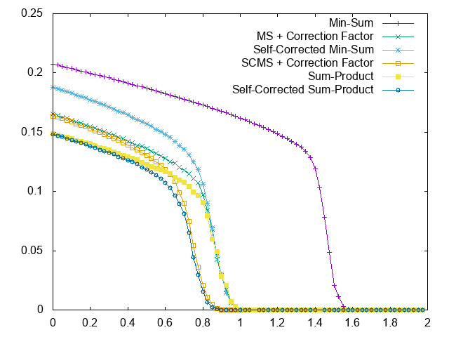
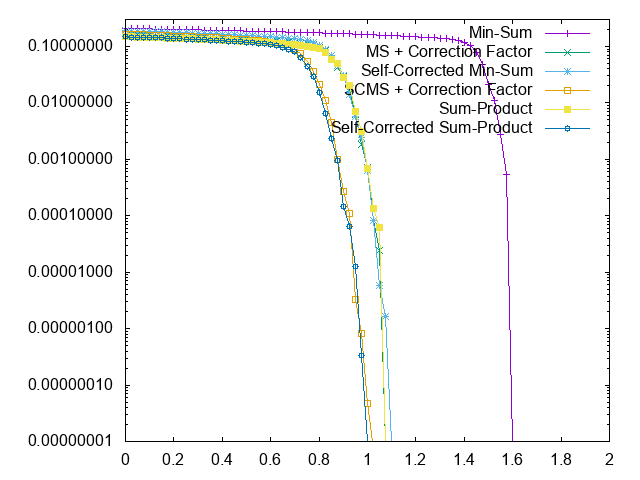
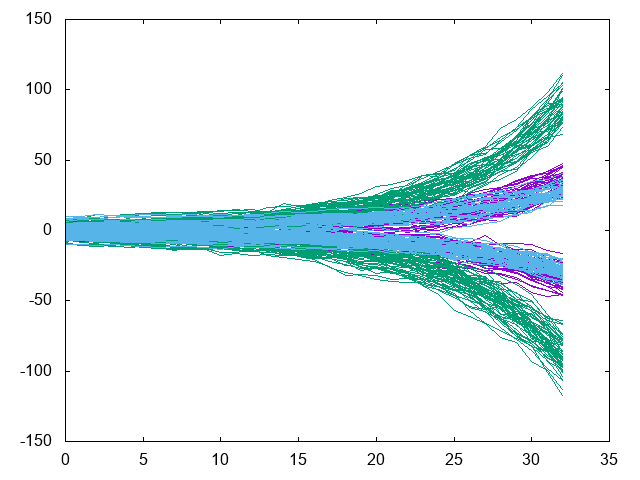
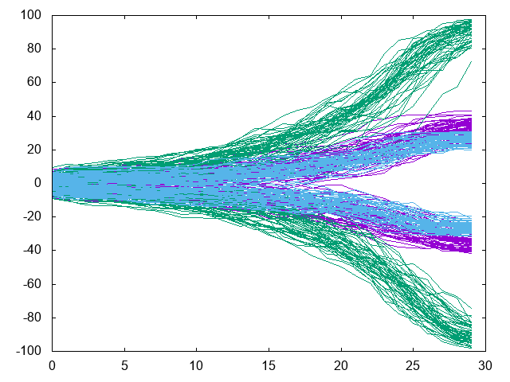
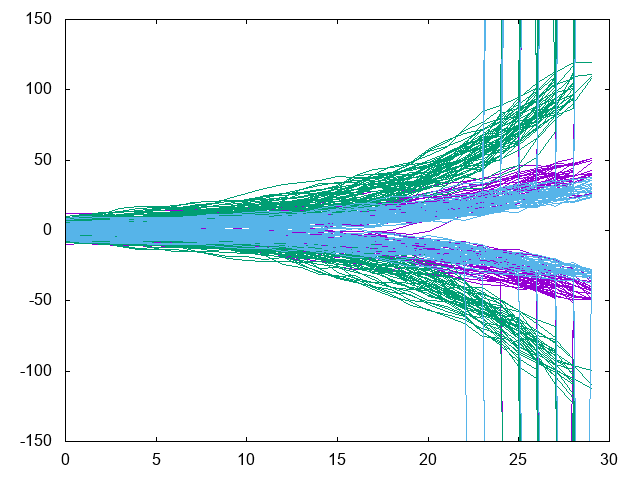
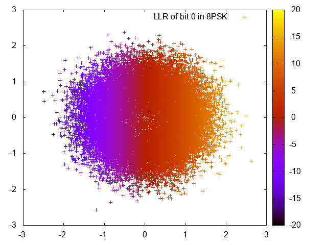
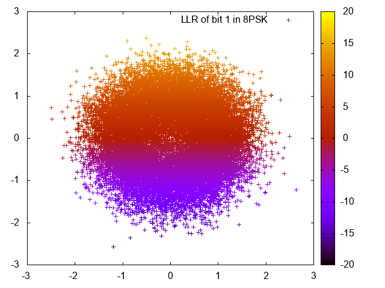
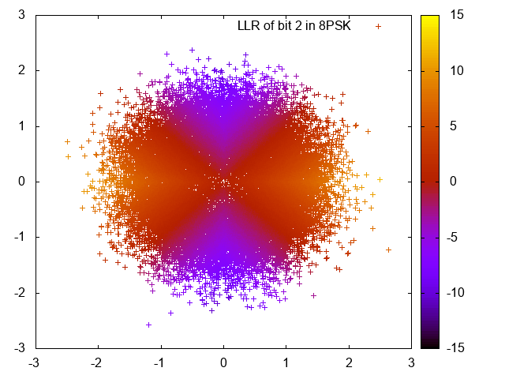

### Playing with [Low-density parity-check codes](https://en.wikipedia.org/wiki/Low-density_parity-check_code)

To study LDPC codes I've started implementing a soft decision decoder using floating point operations only.

For better speed (at almost the same decoding performance) I've added support for [saturating](https://en.wikipedia.org/wiki/Saturation_arithmetic) [fixed-point](https://en.wikipedia.org/wiki/Fixed-point_arithmetic) operations.

Parallel decoding of multiple blocks using [SIMD](https://en.wikipedia.org/wiki/SIMD) is available for all variations of the min-sum algorithm.

You can switch between two decoder schedules:

* flooding schedule: numerically stable but also slow.
* layered schedule: numerical stability is traded for speed.

You can switch between six [Belief propagation](https://en.wikipedia.org/wiki/Belief_propagation) algorithms:

* min-sum algorithm: using minimum and addition
* offset-min-sum algorithm: using minimum, addition and a constant offset
* min-sum-c algorithm: using minimum, addition and a correction factor
* sum-product algorithm: using tanh+atanh-functions, addition and multiplication
* log-sum-product algorithm: using log+exp-functions to replace above multiplication with addition in the log domain
* lambda-min algorithm: same as log-sum-product, but using only lambda minima

You can enable the self-corrected update for any of the above listed algorithms to further boost its decoding performance.
It works by erasing unreliable bit nodes, whose signs fluctuate between updates.
As shown in the BER plots below, the min-sum algorithm benefits the most from the erasures.

Decoding speed varies about 10ms (no errors) to 300ms (max errors) for the rate 1/2 N=64800 code using self-corrected min-sum on my workstation.

Here some good reads:
* Low-Density Parity-Check Codes  
by Robert G. Gallager - 1963
* Near Shannon Limit Performance of Low Density Parity Check Codes  
by David J.C. MacKay and Radford M. Neal - 1996
* An introduction to LDPC codes  
by William E. Ryan - 2003
* An efficient message-passing schedule for LDPC decoding  
by Eran Sharon, Simon Litsyn and Jacob Goldberger - 2004
* DVB-S2 Low Density Parity Check Codes with near Shannon Limit Performance  
by Mustafa Eroz, Feng-Wen Sun and Lin-Nan Lee - 2004
* Reduced-Complexity Decoding of LDPC Codes  
by J. Chen, A. Dholakia, E. Eleftheriou, M. Fossorier and X.–Y. Hu - 2005
* Self-Corrected Min-Sum decoding of LDPC codes  
by Valentin Savin - 2008

Here some DVB standards:
* [en_302307v010201p.pdf](http://www.etsi.org/deliver/etsi_en/302300_302399/302307/01.02.01_60/en_302307v010201p.pdf)
* [a83-1_dvb-s2_den302307v141.pdf](https://www.dvb.org/resources/public/standards/a83-1_dvb-s2_den302307v141.pdf)
* [en_30230702v010101a.pdf](http://www.etsi.org/deliver/etsi_en/302300_302399/30230702/01.01.01_20/en_30230702v010101a.pdf)
* [en_302755v010401p.pdf](https://www.etsi.org/deliver/etsi_en/302700_302799/302755/01.04.01_60/en_302755v010401p.pdf)

### BER comparison of the various algorithms

The following plots were made by computing MS, MSC, SCMS and SCMSC with fixed-point saturating arithmetics using a factor of 2 while SP and SCSP are computed using double precision floating-point arithmetics.

Used DVB-S2 B4 table, QPSK modulation and averaged over 1000 blocks:

To better see the behaviour at low SNR, here with a linear [BER](https://en.wikipedia.org/wiki/Bit_error_rate) scale:


To better see the waterfall region and the boundary to quasi-errorless decoding, here the logarithmic BER scale:


### Impact of the varying degrees of the bit nodes on their convergence behaviour

The color on the following three plots are to be interpreted like this:
* Red: parity bit nodes with degree two
* Green: message bit nodes with degree eight
* Blue: message bit nodes with degree three

This is the second fastest algorithm, min-sum-c, but it needs a few iterations longer to converge:


The sum-product algorithms converge much faster than the min-sum algorithms, but they involve [transcendental functions](https://en.wikipedia.org/wiki/Transcendental_function).


Here we see the fastest convergence, where bit nodes go to minus or plus infinity (and sometimes back from):


### Getting soft information from symbols

For the LDPC codes to work best, one needs soft reliability information for each bit.

Here we see the log-likelihood ratios of the different bits of many 8PSK modulated symbols, disturbed by AWGN:







### [exclusive_reduce.hh](exclusive_reduce.hh)

Reduce N times while excluding ith input element

It computes the following, but having only O(N) complexity and using O(1) extra storage:

```
	output[0] = input[1];
	output[1] = input[0];
	for (int i = 2; i < N; ++i)
		output[i] = op(input[0], input[1]);
	for (int i = 0; i < N; ++i)
		for (int j = 2; j < N; ++j)
			if (i != j)
				output[i] = op(output[i], input[j]);
```


